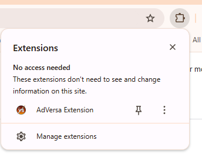
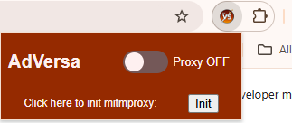

# *AdVersa*: Adversarially-Robust and Practical Ad and Tracker Blocking in the Wild

## Abstract
While machine learning has significantly advanced ad and tracker detection, existing systems face critical challenges in practice. They are vulnerable to adversarial attacks (57-92% evasion rates), fail to generalize to unseen domains due to data contamination, and suffer performance degradation over time, requiring costly retraining. To address these challenges, we present AdVersa, a client-side framework for robust and practical ad and tracker blocking. AdVersa leverages novel, hard-to-perturb latent features from code and URL embeddings to deliver state-of-the-art performance. On a 2.06M-request dataset, our results show that AdVersa achieves a 98.23% F1 score, twice the robustness against adversarial attacks, and strong generalization to unseen domains (91.47% F1 score). For sustainable protection, we demonstrate that a low-cost pseudo-labeling strategy can maintain near-optimal accuracy, reducing maintenance overhead by over 99.8% compared to filter-list curation. Finally, we implement AdVersa as a lightweight, standalone client-side application that ensures user privacy by operating without external dependencies. 

The demo of *AdVersa* blocking ads and trackers in the wild is available in <a href="https://www.youtube.com/watch?v=3Ld1CnOjEDo">this link</a>. 

[](https://www.youtube.com/watch?v=3Ld1CnOjEDo)

<hr>

# 0. Prerequisites
## 0-1. Configuration
This study has been run and tested in both *Ubuntu 20.04.6 LTS (Focal Fossa)* and *Windows 11 Education 24H2*. 
1. Python
    We strongly recommend configuring the environment using Python of versions *<=10* and *>=8*. The specific version used in the study is *3.10.18*.

2. Java
    
    This repository uses the <a href="https://docs.h2o.ai/h2o/latest-stable/h2o-docs/welcome.html#requirements">H2O Python package</a> which requires Java of versions *<=17* and *>=8*. 

3. Git LFS

    This repository requires Git LFS (Large File System). Enabling LFS is described <a href="https://git-lfs.com/">here</a>.

## 0-2. Clone Repository
Click the "Download Repository" button in the upper right corner of this anonymous repository. 
Unzip the contents to the directory you want. 
Ensure the LFS files are pulled, and if not, run the code below:
```bash
$ cd AdVersa-F8F6
$ git lfs pull
```

## 0-3. Install Datasets
Due to the file storage limits, we provide our datasets via Zenodo. Download all data listed <a href="https://zenodo.org/records/17295030">here</a> and place the files corresponding to the *.placeholder* files. 

## 0-4. Configure Environment
Configure the Python venv environment using the script below:
```bash
$ python3 -m venv adversaenv
$ source adversaenv/bin/activate
(adversaenv) $ cd AdVersa-F8F6
(adversaenv) $ pip3 install -r requirements.txt
```

## 0-5. Install PyTorch
Install the version of PyTorch according to your environment from <a href="https://pytorch.org/get-started/locally/">here</a>.

## 0-6. Install Node
Install Node.js according to your environment from <a href="https://nodejs.org/en/download">here</a>.

## 0-7. Install NPM Packages
Install the npm packages used in *AdVersa's* application using the code below:
```bash
(adversaenv) $ cd deployment/localproxy
(adversaenv) $ npm install
```

# 1. Reproducing *AdVersa's* Evaluation

## 1-1. Evaluation
The evaluation source code is provided in *main.py*. By differing the *-p* option, you can walk-through our evaluation process. 
```bash
usage: main.py [-h] -p {model_selection,sota_comparison,unseen_domain,temporal_shift,robustness,ablation} 
               [-m {AdVersa,AdGraph,WebGraph,AdFlush}] 
               [-e {5,10,20,40}] 
               [-c {DC,HSC,HCC,HJC}]

Reproduce AdVersa's Evaluation

options:
  -h, --help            show this help message and exit
  -p {model_selection,sota_comparison,unseen_domain,temporal_shift,robustness,ablation}
                        Evaluation process you want to run
  -m {AdVersa,AdGraph,WebGraph,AdFlush}
                        Target model for YOPO attack
  -e {5,10,20,40}       Epsilon for YOPO attack
  -c {DC,HSC,HCC,HJC}   Cost model for YOPO attack
```

We provide some examples of running our source code below:
```bash
================Start Process================
---------------Sota Comparison---------------
Loading Datasets...
Converting to H2O frame...
...
Model: AdVersa
Accuracy : 0.9879095033508616
Precision : 0.9821910994509084
Recall : 0.9825073170731707
F1 : 0.9823491828144738
False Negative Rate: 0.01749268292682927
False Positive Rate: 0.009277229634296282
AUROC: 0.9866150437194372
TPR 0.9825073170731707 at FPR 0.009277229634296282
================End Process================
```

# 2. Running *AdVersa* in the Wild
## 2-1. Installing *AdVersa* Browser Extension
1. Open a Chrome web browser.

2. Click on the options and navigate to `Extensions` > `Manage Extensions`.

3. Click and enable `Developer mode` on the right upper corner of the page.

4. Click on `Load unpacked`.

5. Navigate to `AdVersa-F8F6/deployment/extension` and click `select folder`.

6. Pin *AdVersa* to ensure convenience. 
    


## 2-1. Setting up MITMProxy
1. Turn on MITMProxy in a terminal
```bash
(adversaenv) $ mitmproxy
```

2. Click on *AdVersa's* browser extension icon, and click on the `Init` button.
    

3. Visit <a href="https://mitm.it/">`mitm.it`</a>. Read the instructions and configure the CA corresponding to your environment.

## 2-2. Running *AdVersa*
1. Turn on the Java server which contains our MOJO model for detecting ads and trackers.
```bash
(adversaenv) $ cd deployment
(adversaenv) $ java -jar adversa-java-server.jar
```

2. With another terminal, start *AdVersa's* MITMProxy addon for preventing ads and trackers. 
```bash
(adversaenv) $ cd deployment/localproxy
(adversaenv) $ mitmdump -q -s adversa_proxy.py
```

5. Click on *AdVersa's* browser extension icon, and click the toggle to turn `Proxy On`.

6. Surf the web with *AdVersa*, ad and tracker free. 